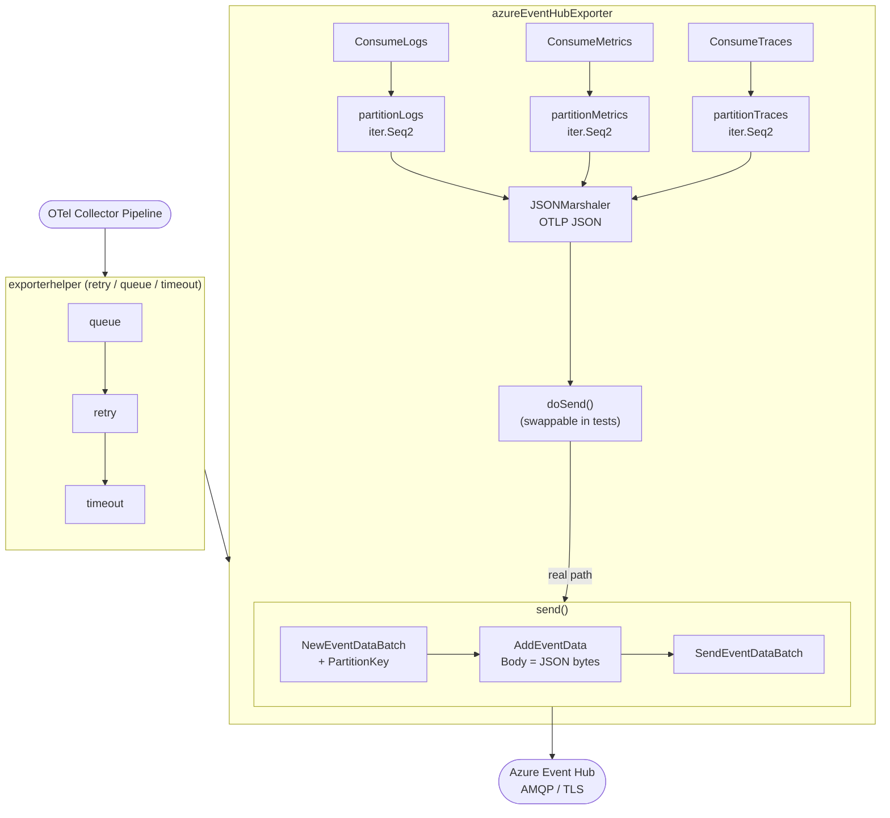

# Azure Event Hub Exporter — Code Guide

A technical walkthrough of every source file, every key design decision, and every data-flow path
in this exporter. Intended for contributors and anyone who wants to understand how the pieces fit
together before touching the code.

---

## Table of Contents

1. [Repository Layout](#repository-layout)
2. [High-Level Architecture](#high-level-architecture)
3. [Data Flow: Logs / Metrics / Traces](#data-flow-logs--metrics--traces)
4. [File-by-File Reference](#file-by-file-reference)
   - [doc.go](#docgo)
   - [config.go](#configgo)
   - [factory.go](#factorygo)
   - [exporter.go](#exportergo)
   - [config_test.go](#config_testgo)
   - [exporter_test.go](#exporter_testgo)
   - [factory_test.go](#factory_testgo)
   - [generated_component_test.go](#generated_component_testgo)
   - [generated_package_test.go](#generated_package_testgo)
   - [internal/metadata/generated_status.go](#internalmetadatagenerated_statusgo)
   - [metadata.yaml](#metadatayaml)
   - [testdata/config.yaml](#testdataconfigyaml)
   - [config.schema.yaml](#configschemayaml)
   - [Authentication.md](#authenticationmd)
5. [Key Design Patterns](#key-design-patterns)
   - [producerClient Interface](#producerclient-interface)
   - [doSend Function Field (Test Injection)](#dosend-function-field-test-injection)
   - [Partition Iterator Pattern (iter.Seq2)](#partition-iterator-pattern-iterseq2)
   - [exporterhelper Wiring](#exporterhelper-wiring)
6. [Authentication Flows](#authentication-flows)
   - [Connection String Path](#connection-string-path)
   - [Auth Extension Path](#auth-extension-path)
7. [Partition Strategies](#partition-strategies)
   - [No Partitioning](#no-partitioning)
   - [Partition Logs by Resource Attributes](#partition-logs-by-resource-attributes)
   - [Partition Logs by Trace ID](#partition-logs-by-trace-id)
   - [Partition Metrics by Resource Attributes](#partition-metrics-by-resource-attributes)
   - [Partition Traces by ID](#partition-traces-by-id)
8. [send() — Event Hub Batch Mechanics](#send--event-hub-batch-mechanics)
9. [Error Handling Strategy](#error-handling-strategy)
10. [Testing Approach](#testing-approach)
11. [Dependency Map](#dependency-map)

---

## Repository Layout

```
azureeventhubexporter/
├── doc.go                          # package declaration + go:generate
├── config.go                       # Config struct + Validate()
├── factory.go                      # NewFactory() and createX helpers
├── exporter.go                     # core exporter logic
├── config_test.go                  # Config.Validate() table tests
├── exporter_test.go                # unit tests for exporter + partition logic
├── factory_test.go                 # factory smoke test
├── generated_component_test.go     # factory lifecycle tests (mdatagen style)
├── generated_package_test.go       # TestMain for goleak skip
├── metadata.yaml                   # component metadata (stability, signals, test opts)
├── config.schema.yaml              # JSON Schema for all config fields
├── Authentication.md               # auth method reference with YAML examples
├── README.md                       # user-facing setup guide + partition examples
├── Makefile                        # test / lint / build / tidy targets
├── go.mod / go.sum
├── internal/
│   └── metadata/
│       └── generated_status.go     # component type, scope name, stability constants
└── testdata/
    └── config.yaml                 # named test configs (12 entries)
```

---

## High-Level Architecture



The exporter is **stateless between calls**: each `Consume*` invocation is independent. State that
persists across calls is limited to the `producer` field (the SDK client, which holds a connection
pool internally).

---

## Data Flow: Logs / Metrics / Traces

Every signal follows the same four-step pattern:

1. **Partition** — call `partitionX(data)` to get an `iter.Seq2[string, T]` iterator.
2. **Iterate** — range over `(partitionKey, partialData)` pairs.
3. **Marshal** — serialize each partial batch to OTLP JSON with `JSONMarshaler`.
4. **Send** — call `e.doSend(ctx, partitionKey, body)`.

The only signal-specific difference is which partition flags are checked and which marshaler is
used. Everything else is structurally identical.

---

## File-by-File Reference

### doc.go

```go
//go:generate make mdatagen
package azureeventhubexporter
```

Two jobs: declares the package import path and records the `go:generate` directive. Running
`go generate ./...` from the repo root regenerates `internal/metadata/generated_status.go` from
`metadata.yaml`. In normal development you do not need to run this; the generated file is
committed.

---

### config.go

Defines the `Config` struct and `EventHubConfig` sub-struct, plus `Config.Validate()`.

**Config fields:**

| Field | Type | Purpose |
|-------|------|---------|
| `Connection` | `string` | SAS connection string. Used when `Auth` is nil. |
| `EventHub.Name` | `string` | Event Hub name. Overrides `EntityPath` in the connection string; required when using `Auth`. |
| `EventHub.Namespace` | `string` | Fully-qualified namespace (e.g. `ns.servicebus.windows.net`). Required when using `Auth`. |
| `Auth` | `*component.ID` | Reference to an auth extension implementing `azcore.TokenCredential`. When set, `Connection` is ignored. |
| `PartitionTracesByID` | `bool` | Partition key = trace ID hex string. |
| `PartitionMetricsByResourceAttributes` | `bool` | Partition key = hash of resource attributes. |
| `PartitionLogsByResourceAttributes` | `bool` | Partition key = hash of resource attributes. Exclusive with `PartitionLogsByTraceID`. |
| `PartitionLogsByTraceID` | `bool` | Partition key = trace ID from log record. Exclusive with `PartitionLogsByResourceAttributes`. |
| `TimeoutSettings` | `exporterhelper.TimeoutConfig` | Per-request timeout. |
| `QueueSettings` | `configoptional.Optional[QueueBatchConfig]` | Sending queue / batcher (optional wrapper allows disabling). |
| `BackOffConfig` | `configretry.BackOffConfig` | Exponential backoff retry settings. |

**Validate() logic:**

```
if Auth != nil:
    require EventHub.Name and EventHub.Namespace
else:
    require Connection != ""
    parse Connection with azeventhubs.ParseConnectionString  ← validates SAS format at startup

if PartitionLogsByResourceAttributes AND PartitionLogsByTraceID:
    error  ← mutually exclusive; only one log partitioning mode allowed
```

Validation runs during `component.Config` loading — before `Start()` is called — so the collector
will refuse to start if the configuration is invalid.

---

### factory.go

The entry point for the OTel collector component system.

**`NewFactory()`** uses `xexporter.NewFactory` (the "cross-signal" factory from
`exporter/xexporter`) because this exporter supports all three signals (logs, metrics, traces).
A standard `exporter.NewFactory` only handles one signal.

```go
func NewFactory() exporter.Factory {
    return xexporter.NewFactory(
        metadata.Type,           // component type ID: "azure_event_hub"
        createDefaultConfig,
        xexporter.WithLogs(createLogsExporter, metadata.LogsStability),
        xexporter.WithMetrics(createMetricsExporter, metadata.MetricsStability),
        xexporter.WithTraces(createTracesExporter, metadata.TracesStability),
    )
}
```

**`createDefaultConfig()`** returns a `*Config` with sensible defaults from the OTel helper
packages. The `QueueSettings` default is wrapped with `configoptional.Default(...)` so users can
disable the queue by setting `sending_queue:` to nothing in YAML.

**`createLogsExporter` / `createMetricsExporter` / `createTracesExporter`** follow the same
pattern:

```go
exp := newExporter(cfg.(*Config), set.Logger)   // 1. create our struct
return exporterhelper.NewLogs(ctx, set, cfg,
    exp.ConsumeLogs,                             // 2. pass the consume function
    exporterhelper.WithStart(exp.start),         // 3. lifecycle hooks
    exporterhelper.WithShutdown(exp.shutdown),
    exporterhelper.WithTimeout(exp.config.TimeoutSettings),
    exporterhelper.WithQueue(exp.config.QueueSettings),
    exporterhelper.WithRetry(exp.config.BackOffConfig),
)
```

`exporterhelper` wraps `ConsumeLogs` so that the actual Event Hub call is executed inside a
pipeline that enforces the timeout, queues data if the downstream is slow, and retries on
transient errors. Our `ConsumeLogs` implementation only needs to handle one attempt; retry policy
is owned by the helper.

---

### exporter.go

The core implementation file. Contains five things:

#### 1. `traceIDToHex`

```go
func traceIDToHex(id pcommon.TraceID) string {
    if id.IsEmpty() { return "" }
    return id.String()
}
```

This function exists because the monorepo's `internal/coreinternal/traceutil` package is blocked
by Go's `internal` package restriction for external modules. Rather than vendoring the entire
package, we inline the single function we need. The implementation is identical to the original.

#### 2. `producerClient` interface

```go
type producerClient interface {
    NewEventDataBatch(ctx context.Context, options *azeventhubs.EventDataBatchOptions) (*azeventhubs.EventDataBatch, error)
    SendEventDataBatch(ctx context.Context, batch *azeventhubs.EventDataBatch, options *azeventhubs.SendEventDataBatchOptions) error
    Close(ctx context.Context) error
}
```

The SDK's `*azeventhubs.ProducerClient` satisfies this interface. The interface exists solely to
make the `producer` field injectable in tests without requiring a live AMQP connection. See
[producerClient Interface](#producerclient-interface) for the full rationale.

#### 3. `azureEventHubExporter` struct

```go
type azureEventHubExporter struct {
    config   *Config
    producer producerClient
    logger   *zap.Logger
    doSend   func(ctx context.Context, partitionKey string, body []byte) error
}
```

Fields:
- `config` — pointer to the validated config; never mutated after construction.
- `producer` — nil until `start()` is called; closed in `shutdown()`.
- `logger` — used only for the "both auth and connection specified" warning.
- `doSend` — see [doSend Function Field](#dosend-function-field-test-injection).

#### 4. `start()` and `shutdown()`

`start()` creates the SDK client. Two branches:

- **Auth branch** (`e.config.Auth != nil`): Looks up the auth extension from
  `host.GetExtensions()`, type-asserts it to `azcore.TokenCredential`, then calls
  `azeventhubs.NewProducerClient(namespace, hubName, credential, nil)`.
- **Connection string branch**: Calls
  `azeventhubs.NewProducerClientFromConnectionString(connection, hubName, nil)`.
  If `hubName` is empty, the SDK reads `EntityPath` from the connection string.

Neither call establishes an AMQP connection — the SDK connects lazily on the first send. This is
why the `start()` tests can run without a real Event Hub.

`shutdown()` calls `e.producer.Close(ctx)` if the producer was initialized. Safe to call with a
nil producer (e.g., if `start()` was never called).

#### 5. Partition iterators and Consume* methods

See the [Partition Strategies](#partition-strategies) section below for the full explanation.

---

### config_test.go

Table-driven tests covering all `Config.Validate()` branches:

| Test case | What it validates |
|-----------|-------------------|
| `missing connection and auth` | Both `Connection` and `Auth` are zero — must error |
| `invalid connection string` | Malformed SAS string — SDK parse error propagated |
| `valid connection string` | Happy path with a well-formed SAS string |
| `auth without event_hub.name` | `Auth` set but `EventHub.Name` empty |
| `auth without event_hub.namespace` | `Auth` set but `EventHub.Namespace` empty |
| `valid auth config` | Both name and namespace present with auth |
| `logs partition flags exclusive` | Both log partition flags enabled — must error |
| `partition_logs_by_resource_attributes alone` | Valid single flag |
| `partition_logs_by_trace_id alone` | Valid single flag |
| `partition_traces_by_id` | Valid flag |
| `partition_metrics_by_resource_attributes` | Valid flag |

The error assertion uses `assert.ErrorContains` rather than exact equality, which makes tests
robust to minor SDK error message wording changes.

---

### exporter_test.go

Comprehensive unit tests with **no real Azure dependency**. The file is divided into sections:

**Test helpers:**

- `sentEvent` — captures `(partitionKey, body)` pairs from `doSend`.
- `captureSender` — returns a `doSend`-compatible function that appends to a `[]sentEvent`.
- `errSender` — returns a `doSend`-compatible function that always returns a given error.
- `newTestExporter` — builds an `azureEventHubExporter` with a no-op logger, without calling
  `start()`. Tests that need a live producer inject `fakeProducer` directly.

**Partition iterator tests** (`TestPartitionX_*`):

Test the iterator functions in isolation by ranging over the returned `iter.Seq2`. Assertions
check key count, key length (32 chars for trace IDs), and key equality for identical resources.

**Consume\* tests** (`TestConsumeX_*`):

Wire up `captureSender` or `errSender` to `doSend`, call `Consume*`, and assert on:
- Number of `sentEvent` records (one per partition group)
- Value of `partitionKey`
- Non-emptiness of `body`
- Error propagation from `doSend`

**`fakeProducer`:**

```go
type fakeProducer struct {
    newBatchErr  error
    sendBatchErr error
    closed       bool
}
```

Satisfies `producerClient`. Returns controlled errors from `NewEventDataBatch` and
`SendEventDataBatch`. Note that when `newBatchErr` is nil, `NewEventDataBatch` returns `(nil,
nil)` — meaning the batch pointer is nil. Passing a nil `*azeventhubs.EventDataBatch` to
`AddEventData` will panic in the real SDK, but that path (successful batch creation + body add)
cannot be tested without a live AMQP connection to obtain a valid batch object.

**`send()` tests** test only the error paths (broker unavailable from `NewEventDataBatch`).

**`start()` tests:**

- `TestStart_ConnectionString` — valid SAS string, no network.
- `TestStart_AuthExtensionNotFound` — extension ID not registered in host.
- `TestStart_AuthExtensionWrongType` — extension registered but wrong type.
- `TestStart_AuthExtensionValid` — `fakeTokenCredential` satisfies `azcore.TokenCredential`.
- `TestStart_AuthIgnoresConnectionString` — when `Auth` is set, `Connection` is ignored.

**`hostWithExtensions`** is a minimal `component.Host` wrapper that returns a fixed extension map.

---

### factory_test.go

A single test that calls `NewFactory()` and checks the returned type is `metadata.Type`.
Primarily a sanity check that the factory wires up without panicking.

---

### generated_component_test.go

Mirrors the output of the `mdatagen` tool. Tests the full lifecycle of each signal's exporter:

1. Call `NewFactory().CreateXExporter(...)` with a valid config.
2. Call `Shutdown(ctx)` (skips `Start` because `skip_lifecycle: true` in `metadata.yaml`).

Why skip `Start`? Because `start()` creates an SDK client that dials Azure. In CI or local unit
tests, no Azure credentials are available. Setting `skip_lifecycle: true` in `metadata.yaml`
tells the generated test to only call `Shutdown`.

Each `generateLifecycleTestX` helper creates minimal pdata (a single resource with one data
point/record/span) to exercise the factory path without sending real data.

---

### generated_package_test.go

```go
func TestMain(m *testing.M) {
    os.Exit(m.Run())
}
```

`goleak` is disabled for this package (via `goleak: { skip: true }` in `metadata.yaml`). The
Azure SDK's AMQP connection management may leave background goroutines alive after `Close()` in
some code paths. Using a plain `os.Exit(m.Run())` instead of `goleak.VerifyTestMain(m)` prevents
false-positive goroutine leak failures in tests that never open a real connection.

---

### internal/metadata/generated_status.go

```go
var (
    Type      = component.MustNewType("azure_event_hub")
    ScopeName = "github.com/ssijbabu/azureeventhubexporter"
)
const (
    MetricsStability = component.StabilityLevelDevelopment
    LogsStability    = component.StabilityLevelDevelopment
    TracesStability  = component.StabilityLevelDevelopment
)
```

`Type` is the component type string used in collector config YAML (`type: azure_event_hub`).
`ScopeName` is the OTel instrumentation scope name (appears in self-observability metrics).
All three stability constants are `Development` — the appropriate level for a new, unproven
component.

This file is normally generated from `metadata.yaml` by `mdatagen`. In this standalone repo it
was hand-written to match the tool's output format, since `mdatagen` is part of the monorepo
toolchain.

---

### metadata.yaml

Declares the component's identity for tooling:

```yaml
type: azure_event_hub
status:
  class: exporter
  stability:
    development: [metrics, logs, traces]
tests:
  skip_lifecycle: true
  goleak:
    skip: true
```

Key flags:
- `skip_lifecycle: true` — `generated_component_test.go` skips the `Start()` call.
- `goleak: { skip: true }` — `generated_package_test.go` uses plain `os.Exit` instead of goleak.

---

### testdata/config.yaml

Contains 12 named configurations used by `factory_test.go` and documentation examples:

| Key | Tests |
|-----|-------|
| `default_conn_string` | Minimal working config |
| `auth` | Auth extension + hub name/namespace |
| `hub_name_override` | `event_hub.name` overrides `EntityPath` |
| `partition_traces_by_id` | Trace partitioning |
| `partition_metrics_by_resource` | Metrics resource partitioning |
| `partition_logs_by_resource` | Logs resource partitioning |
| `partition_logs_by_trace_id` | Logs trace-ID partitioning |
| `queue_tuning` | Custom queue size / num_consumers |
| `missing_connection` | Expected validation error |
| `invalid_connection_string` | Expected parse error |
| `auth_missing_hub_name` | Expected validation error |
| `auth_missing_namespace` | Expected validation error |

---

### config.schema.yaml

A JSON Schema (in YAML syntax) describing every field in `Config`. Useful for IDE autocompletion,
documentation generators, and static configuration linters. Structured as a `$defs` block for
`event_hub_config` with `$ref` links to upstream collector schema definitions for
`timeout_config`, `queue_batch_config`, and `back_off_config`.

---

### Authentication.md

Covers all supported auth methods with YAML examples:

1. **Connection string** — SAS with embedded key.
2. **Service principal (client secret)** — App Registration with client ID + tenant ID + secret.
3. **System-assigned managed identity** — No credentials; runs on Azure-hosted infra.
4. **User-assigned managed identity** — Client ID required; supports multiple identities per VM.
5. **Workload identity** — Kubernetes federated credential; no secret rotation needed.

Includes the Azure CLI commands to create the required RBAC assignments
(`Azure Event Hubs Data Sender` role).

---

## Key Design Patterns

### producerClient Interface

The Azure SDK provides `*azeventhubs.ProducerClient`, a concrete struct. Wrapping it in an
interface:

```go
type producerClient interface {
    NewEventDataBatch(...)
    SendEventDataBatch(...)
    Close(...)
}
```

...allows tests to inject a `fakeProducer` without establishing a real AMQP connection to Azure.
Without this interface, every test that touches `send()` would require live Azure credentials and
a reachable Event Hub — impractical in CI.

The interface is intentionally minimal: only the three methods this exporter calls. Adding methods
that are not used would make test doubles harder to maintain.

### doSend Function Field (Test Injection)

`ConsumeLogs` / `ConsumeMetrics` / `ConsumeTraces` all call `e.doSend(ctx, partitionKey, body)`.

Why not call `e.send(...)` directly? Go does not support virtual method dispatch through struct
embedding — if `ConsumeLogs` called `e.send()` directly, there would be no way to intercept it
in a test without a real SDK client. The `doSend` field is a function value:

```go
type azureEventHubExporter struct {
    ...
    doSend func(ctx context.Context, partitionKey string, body []byte) error
}
```

`newExporter` sets `e.doSend = e.send` (binding the method value). Tests replace it:

```go
var sent []sentEvent
exp.doSend = captureSender(&sent)
```

This pattern lets tests verify:
- That the correct partition key is passed to `doSend`.
- That marshaled body bytes are non-empty.
- That errors from `doSend` are propagated correctly.

...all without a live Azure connection. The real `send()` function is tested separately via
`fakeProducer` for its error branches.

### Partition Iterator Pattern (iter.Seq2)

Go 1.23 introduced `iter.Seq2[K, V]` — a function type `func(yield func(K, V) bool)` that can
be used with `for k, v := range seq { ... }`. The exporter uses this for partition iterators:

```go
func (e *azureEventHubExporter) partitionLogs(ld plog.Logs) iter.Seq2[string, plog.Logs] {
    return func(yield func(string, plog.Logs) bool) {
        // ... call yield for each (partitionKey, partialLogs) pair
        // early-exit if yield returns false
    }
}
```

**Why iterators instead of returning a slice?**

- **Memory**: Each yielded batch is marshaled and sent before the next is created. No need to
  accumulate all partition groups in memory simultaneously.
- **Early exit**: If `doSend` returns an error, the `Consume*` method returns immediately. With
  a slice, the iteration would have to buffer all groups first.
- **Consistency with Kafka exporter**: The Kafka exporter in the monorepo uses the same pattern,
  making the code familiar to contributors from that area.

**Inside the iterators:**

*Resource-attribute partitioning* (logs and metrics):

```go
newLogs := plog.NewLogs()
target := newLogs.ResourceLogs().AppendEmpty()
for _, resourceLogs := range ld.ResourceLogs().All() {
    hash := pdatautil.MapHash(resourceLogs.Resource().Attributes())
    resourceLogs.CopyTo(target)          // reuse the same container
    if !yield(string(hash[:]), newLogs) { return }
}
```

`pdatautil.MapHash` produces a deterministic 16-byte hash of the attribute map. Converting to
`string(hash[:])` turns the `[16]byte` into a binary string key. The same attribute set will
always produce the same key, so all data from a given resource goes to the same Event Hub
partition on every send.

*Trace-ID partitioning* (logs and traces):

For traces, `batchpersignal.SplitTraces(td)` returns one `ptrace.Traces` per distinct trace ID.
The first span's trace ID is extracted and hex-encoded as the partition key.

For logs, `batchpersignal.SplitLogs(ld)` does the equivalent, grouping log records by the trace
ID field on each record. Log records without a trace ID get an empty string key.

### exporterhelper Wiring

`exporterhelper` provides retry, queue, and timeout as middleware around the `Consume*` function.
The factory wires each signal like this:

```
OTel pipeline → exporterhelper wrapper
                    ├── timeout enforcement    (from TimeoutSettings)
                    ├── queue / batching       (from QueueSettings)
                    ├── retry on failure       (from BackOffConfig)
                    └── exp.ConsumeLogs(...)   ← our code
```

This means our `ConsumeLogs` implementation does not need to handle timeouts, queue management,
or retry logic. If `ConsumeLogs` returns an error, the helper decides whether to retry based on
whether the error is permanent or transient (using `consumererror.NewPermanent` / transient
sentinel).

`configoptional.Optional[QueueBatchConfig]` is used instead of a plain `QueueBatchConfig` so
users can set `sending_queue: {}` in YAML to disable the queue entirely. Without the `Optional`
wrapper, a zero-value `QueueBatchConfig` would still enable the queue with zero capacity.

---

## Authentication Flows

### Connection String Path

```
Config.Connection = "Endpoint=sb://...;SharedAccessKeyName=...;SharedAccessKey=...;EntityPath=..."
Config.Auth = nil
```

At `start()`:

```go
azeventhubs.NewProducerClientFromConnectionString(
    e.config.Connection,
    e.config.EventHub.Name,  // overrides EntityPath if non-empty
    nil,                     // default options
)
```

The SDK parses the SAS token from the connection string and handles token refresh internally.
`Config.Validate()` calls `azeventhubs.ParseConnectionString(c.Connection)` at config-load time
to catch malformed strings before `start()` is ever called.

### Auth Extension Path

```
Config.Auth = &component.ID{"azureauth", ""}
Config.EventHub.Name = "myhub"
Config.EventHub.Namespace = "mynamespace.servicebus.windows.net"
Config.Connection = ""  (or ignored if set)
```

At `start()`:

1. Look up the extension: `host.GetExtensions()[*e.config.Auth]`.
2. Type-assert to `azcore.TokenCredential`.
3. Call `azeventhubs.NewProducerClient(namespace, hubName, credential, nil)`.

The `azureauthextension` from the OTel Contrib repo implements `azcore.TokenCredential` for all
Azure identity types (service principal, managed identity, workload identity). From the
exporter's perspective, authentication is just "something that can return an `azcore.AccessToken`"
— the extension handles the specifics.

If the `auth` component ID is not found in the extension registry, `start()` returns an error
that prevents the collector from starting, rather than silently failing at send time.

---

## Partition Strategies

### No Partitioning

Default when no partition flags are set.

```
iterator yields:  ("", fullBatch)
result:           one Event Hub message per Consume* call
partition:        Event Hub round-robins across available partitions
```

Use this for the simplest setup when ordering guarantees are not required.

### Partition Logs by Resource Attributes

```yaml
partition_logs_by_resource_attributes: true
```

```
iterator yields:  (hash(resourceAttrs), singleResourceLogs)  — one per ResourceLogs entry
result:           one Event Hub message per distinct resource in the batch
partition:        all logs from the same resource always go to the same partition
```

The hash is computed by `pdatautil.MapHash`, which produces a stable 16-byte value from the
attribute map regardless of insertion order.

### Partition Logs by Trace ID

```yaml
partition_logs_by_trace_id: true
```

```
iterator yields:  (traceIDHex, logsForOneTrace)  — one per distinct trace ID
result:           one Event Hub message per distinct trace ID
partition:        all log records for a trace land on the same partition as their trace spans
```

Empty trace IDs produce an empty-string key (Event Hub picks the partition).

**Mutually exclusive** with `partition_logs_by_resource_attributes`. Enabling both is a
validation error.

### Partition Metrics by Resource Attributes

```yaml
partition_metrics_by_resource_attributes: true
```

Same mechanics as the logs variant: one message per resource, partition key = attribute hash.

### Partition Traces by ID

```yaml
partition_traces_by_id: true
```

```
iterator yields:  (traceIDHex, singleTraceSpans)  — one per distinct trace ID
result:           one Event Hub message per distinct trace ID
partition:        all spans for a trace go to the same partition
```

`batchpersignal.SplitTraces` handles the splitting; the exporter only extracts the trace ID from
the first span of the first resource.

---

## send() — Event Hub Batch Mechanics

```go
func (e *azureEventHubExporter) send(ctx context.Context, partitionKey string, body []byte) error {
    var opts *azeventhubs.EventDataBatchOptions
    if partitionKey != "" {
        opts = &azeventhubs.EventDataBatchOptions{PartitionKey: &partitionKey}
    }

    batch, err := e.producer.NewEventDataBatch(ctx, opts)
    // ...
    if err = batch.AddEventData(&azeventhubs.EventData{Body: body}, nil); err != nil {
        if errors.Is(err, azeventhubs.ErrEventDataTooLarge) {
            return fmt.Errorf("telemetry payload (%d bytes) exceeds the maximum Event Hub message size...", len(body))
        }
        return fmt.Errorf("failed to add event data to batch: %w", err)
    }
    return e.producer.SendEventDataBatch(ctx, batch, nil)
}
```

**Why a new batch per send?**

Event Hub's `EventDataBatch` is a single AMQP message envelope. Its partition key is fixed at
creation time (`EventDataBatchOptions.PartitionKey`). Since each partition group needs its own
key, each group requires its own batch. The batch is created, one event is added, and it is
immediately sent — there is no attempt to pack multiple telemetry records into one AMQP message.

**Why not pack multiple records?**

The OTel SDK's `exporterhelper` already batches data upstream. By the time `ConsumeLogs` is
called, the input `plog.Logs` may already contain hundreds of log records. Marshaling the entire
resource group as one OTLP JSON message and sending it as one AMQP event is the most efficient
approach for the downstream consumer (e.g., Azure Stream Analytics, a custom consumer).

**ErrEventDataTooLarge:**

Event Hub's maximum message size is 1 MB for standard tiers and 1 MB–100 MB for premium/dedicated
tiers. If a single partition group's JSON exceeds the limit, `AddEventData` returns
`azeventhubs.ErrEventDataTooLarge`. The error message includes the byte count to help the user
diagnose whether they need a higher-tier Event Hub or should reduce upstream batch sizes.

---

## Error Handling Strategy

| Layer | What errors it handles |
|-------|------------------------|
| `Config.Validate()` | Config errors at startup — prevents collector from starting |
| `start()` | Auth/connection errors — collector refuses to start |
| `partitionX()` | Iterator is infallible — no errors from splitting/hashing |
| `JSONMarshaler` | Marshaling errors wrapped as `"failed to marshal X: ..."` |
| `send()` | SDK errors wrapped as `"failed to create/add/send event data batch: ..."` |
| `exporterhelper` | Retries `send()` errors if they are not permanent |

Errors from `ConsumeLogs/Metrics/Traces` propagate back to `exporterhelper`, which decides
whether to retry based on whether the error implements the `consumererror.Permanent` sentinel. By
default, all errors returned here are treated as retryable unless wrapped with
`consumererror.NewPermanent(err)`. Currently the exporter does not classify errors as permanent;
it relies on the retry budget configured by `BackOffConfig` to eventually give up.

---

## Testing Approach

The test suite achieves full coverage of all branches that can be exercised without a live Azure
connection:

| Area | Approach |
|------|----------|
| Config validation | Table tests in `config_test.go` |
| Partition iterators | Direct iterator tests in `exporter_test.go` |
| Consume* routing | `captureSender` injection via `doSend` field |
| Error propagation | `errSender` injection |
| `send()` error paths | `fakeProducer` with controlled errors |
| `start()` lifecycle | Real SDK client (no network; connection is lazy) |
| Auth extension wiring | `fakeTokenCredential` + `hostWithExtensions` |
| Factory construction | `factory_test.go` + `generated_component_test.go` |

The `send()` happy path (successful `AddEventData` + `SendEventDataBatch`) is **not unit-tested**
because a valid `*azeventhubs.EventDataBatch` can only be obtained from the SDK after a live AMQP
connection is established. This branch would require an integration test with a real or emulated
Event Hub.

---

## Dependency Map

| Package | Used for |
|---------|----------|
| `github.com/Azure/azure-sdk-for-go/sdk/azcore` | `azcore.TokenCredential` interface |
| `github.com/Azure/azure-sdk-for-go/sdk/messaging/azeventhubs/v2` | `ProducerClient`, `EventDataBatch`, `EventData` |
| `go.opentelemetry.io/collector/component` | `component.ID`, `component.Host`, `component.Config` |
| `go.opentelemetry.io/collector/exporter` | `exporter.Factory`, `exporter.Settings`, `exporter.Logs/Metrics/Traces` |
| `go.opentelemetry.io/collector/exporter/exporterhelper` | Retry, queue, timeout wrapping; `NewLogs/Metrics/Traces` |
| `go.opentelemetry.io/collector/exporter/xexporter` | `xexporter.NewFactory` for multi-signal support |
| `go.opentelemetry.io/collector/config/configoptional` | `Optional[T]` wrapper for disableable queue |
| `go.opentelemetry.io/collector/config/configretry` | `BackOffConfig` struct |
| `go.opentelemetry.io/collector/pdata/plog` | Log data types + `JSONMarshaler` |
| `go.opentelemetry.io/collector/pdata/pmetric` | Metric data types + `JSONMarshaler` |
| `go.opentelemetry.io/collector/pdata/ptrace` | Trace data types + `JSONMarshaler` |
| `go.opentelemetry.io/collector/pdata/pcommon` | `TraceID`, `Map` |
| `github.com/open-telemetry/opentelemetry-collector-contrib/pkg/batchpersignal` | `SplitTraces`, `SplitLogs` — split by trace ID |
| `github.com/open-telemetry/opentelemetry-collector-contrib/pkg/pdatautil` | `MapHash` — deterministic attribute hashing |
| `go.uber.org/zap` | Structured logging |
